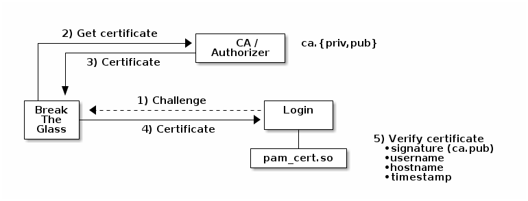

# pam-cert

Pluggable Authentication Module (PAM) using certificate authentication.

# References

 - The [Ed25519](module/ed25519) is from [github.com/orlp/ed25519](https://github.com/orlp/ed25519).
